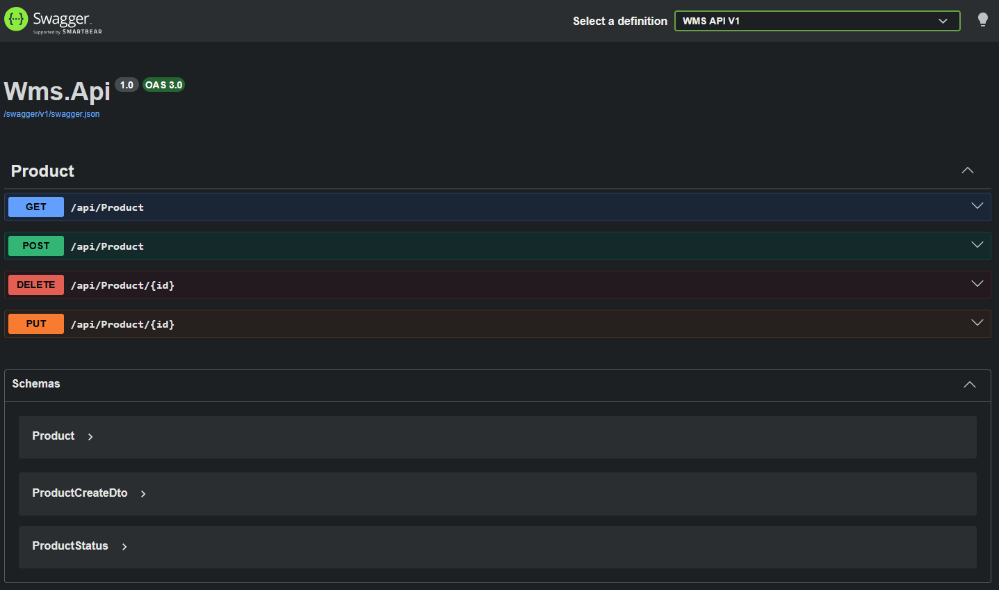
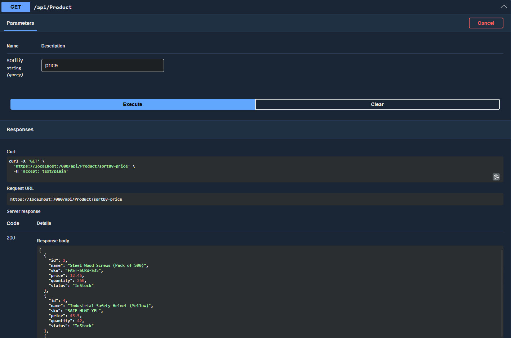
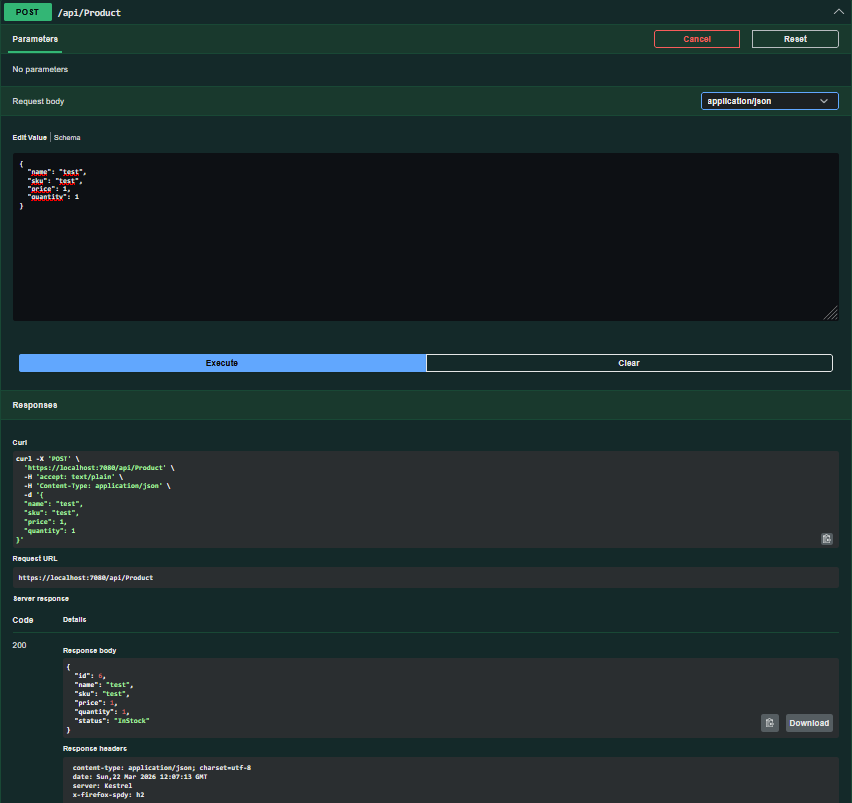

# 🏭 Warehouse Management System (WMS) API

## 📦 Overview

This project is a backend application built with ASP.NET Core for managing warehouse inventory.

It allows users to create, update, and manage items, track their availability, and interact with a structured REST API.

---

## 🚀 Features

* 📦 Create, update, and delete warehouse items
* 🔎 Retrieve all items or filter by availability
* 📊 Track item quantity and stock status
* ⚙️ Automatic status handling (InStock / OutOfStock)
* 🌐 RESTful API with clean architecture

---

## 🛠 Technologies

* C#
* ASP.NET Core Web API
* Entity Framework Core
* SQLite / SQL Server
* Swagger (API testing)

---

## 🧠 Business Logic

* Item status is automatically calculated:

  * `Quantity > 0 → InStock`
  * `Quantity == 0 → OutOfStock`

* Data consistency ensured via strongly typed enum (`ItemStatus`)

---

## 📬 API Endpoints

### 🔹 Get all items

GET /api/items

### 🔹 Create item

POST /api/items

### 🔹 Update item

PUT /api/items/{id}

### 🔹 Delete item

DELETE /api/items/{id}

---

## ▶️ How to Run

dotnet run

Then open Swagger:
[https://localhost:xxxx/swagger](https://localhost:xxxx/swagger)

---

## 📸 Screenshots

### Swagger UI

### Get Items Response

### Create Item Request

---

## 📌 Future Improvements

* Authentication (JWT)
* Pagination and filtering
* Docker support
* Frontend integration
